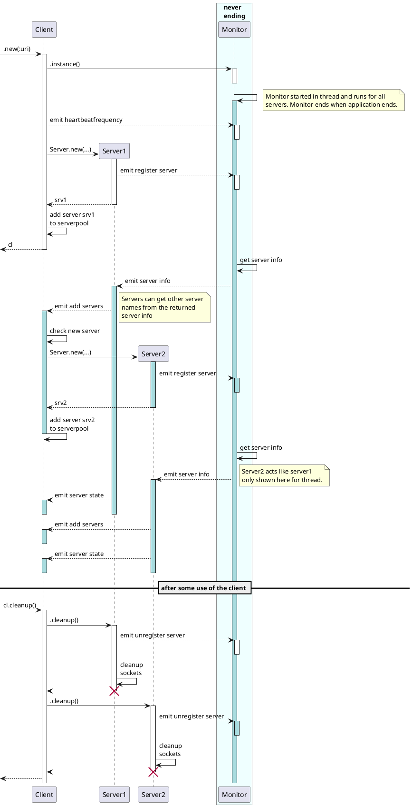

```plantuml
@startuml


skinparam sequence {
'  LifeLineBorderColor blue
  LifeLineBackgroundColor #fff
}

participant Client
participant Server1
participant Server2
participant Monitor

-> Client ++: .new(:uri)

box "never\nending" #efffff
  participant Monitor
end box

Client -> Monitor ++: .instance()
deactivate Monitor
Monitor -> Monitor ++ #A9DCDF:
note right
  Monitor started in thread and runs for all
  servers. Monitor ends when application ends.
end note

Client --> Monitor ++ : emit heartbeatfrequency
deactivate Monitor

create Server1
Client -> Server1 ++: Server.new(...)
Server1 --> Monitor ++: emit register server
deactivate Monitor
return srv1
Client -> Client: add server srv1 \nto serverpool

<-- Client: cl
deactivate Client

Monitor -> Monitor: get server info
Monitor --> Server1 ++ #A9DCDF: emit server info

Server1 --> Client ++ #A9DCDF: emit add servers
  note right
    Servers can get other server
    names from the returned
    server info
  end note

  Client -> Client: check new server
  create Server2
  Client -> Server2 ++ #A9DCDF: Server.new(...)
  Server2 --> Monitor ++ #A9DCDF: emit register server
  deactivate Monitor
  return srv2
  Client -> Client: add server srv2\nto serverpool
  deactivate Client

  Monitor -> Monitor: get server info

  Monitor --> Server2 ++ #A9DCDF: emit server info
  note right
    Server2 acts like server1
    only shown here for thread.
  end note


Server1 --> Client ++ #A9DCDF: emit server state
deactivate Client
deactivate Server1

Server2 --> Client ++ #A9DCDF: emit add servers

deactivate Client
Server2 --> Client ++ #A9DCDF: emit server state
deactivate Client
deactivate Server2

== after some use of the client ==

-> Client ++: cl.cleanup()
Client -> Server1++: .cleanup()
Server1 --> Monitor ++: emit unregister server
deactivate Monitor

Server1 -> Server1: cleanup\nsockets
Server1 --> Client:
destroy Server1

Client -> Server2 ++: .cleanup()
Server2 --> Monitor ++ #A9DCDF: emit unregister server
deactivate Monitor

Server2 -> Server2: cleanup\nsockets
Server2 --> Client:

deactivate Server2
destroy Server2

<-- Client:

@enduml
```
