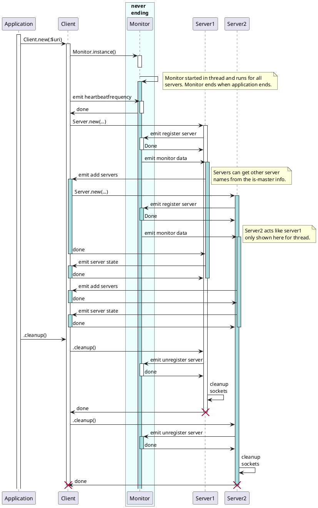

```plantuml
@startuml


skinparam sequence {
'  LifeLineBorderColor blue
  LifeLineBackgroundColor #fff
}

participant Application
activate Application

participant Client

Application -> Client: Client.new(:$uri)
activate Client

box "never\nending" #efffff
  participant Monitor
end box

Client -> Monitor ++: Monitor.instance()
'Monitor -> Monitor --: Monitor
deactivate Monitor
Monitor -> Monitor ++ #A9DCDF:
note right
  Monitor started in thread and runs for all
  servers. Monitor ends when application ends.
end note

Client -> Monitor ++ : emit heartbeatfrequency
Monitor -> Client --: done

Client -> Server1 ++: Server.new(...)
Server1 -> Monitor ++: emit register server
Monitor -> Server1 --: Done

Monitor -> Server1 ++ #A9DCDF: emit monitor data

Server1 -> Client ++ #A9DCDF: emit add servers
  note right
    Servers can get other server
    names from the is-master info.
  end note

  Client -> Server2 ++ #A9DCDF: Server.new(...)
  Server2 -> Monitor ++ #A9DCDF: emit register server
  Monitor -> Server2 --: Done
  Monitor -> Server2 ++ #A9DCDF: emit monitor data
  note right
    Server2 acts like server1
    only shown here for thread.
  end note

Client -> Server1 --: done
Server1 -> Client ++ #A9DCDF: emit server state
Client -> Server1 --: done
deactivate Server1

Server2 -> Client ++ #A9DCDF: emit add servers
Client -> Server2 --: done
Server2 -> Client ++ #A9DCDF: emit server state
Client -> Server2 --: done
deactivate Server2


Application -> Client: .cleanup()
Client -> Server1: .cleanup()
Server1 -> Monitor ++: emit unregister server
Monitor -> Server1 --: done
Server1 -> Server1: cleanup\nsockets
Server1 -> Client: done
destroy Server1

Client -> Server2: .cleanup()
Server2 -> Monitor ++ #A9DCDF: emit unregister server
Monitor -> Server2 -- #A9DCDF: done
Server2 -> Server2: cleanup\nsockets
Server2 -> Client: done
destroy Server2

destroy Client

@enduml
```
