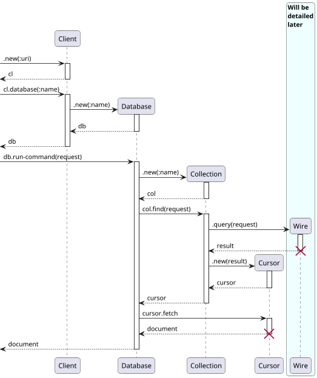

```plantuml
@startuml
scale 0.8

skinparam roundcorner 10
skinparam sequence {
'  LifeLineBorderColor blue
  LifeLineBackgroundColor #fff
}

'box "never\nending" #efffff
'  participant Wire
'end box

'participant "User Application" as Application
'activate Application

participant Client
participant Database
participant Collection
participant Cursor
box "Will be\ndetailed\nlater" #efffff
  participant Wire
end box

-> Client ++: .new(:uri)
create Client
return cl


-> Client ++: cl.database(:name)
create Database
Client -> Database ++: .new(:name)
return db
return db

-> Database ++: db.run-command(request)
create Collection
Database -> Collection ++: .new(:name)
return col
Database -> Collection ++: col.find(request)

create Wire
Collection -> Wire ++: .query(request)
return result
destroy Wire

create Cursor
Collection -> Cursor ++: .new(result)
return cursor

return cursor

Database -> Cursor ++: cursor.fetch
return document

destroy Cursor
return document

@enduml
```
