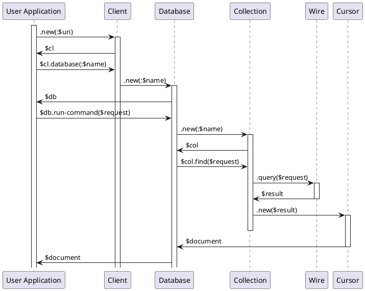

```plantuml
@startuml
'scale 0.8

skinparam sequence {
'  LifeLineBorderColor blue
  LifeLineBackgroundColor #fff
}

participant "User Application" as Application
activate Application

participant Client
participant Database
participant Collection
participant Wire
participant Cursor

Application -> Client : .new(:$uri)
activate Client
Client -> Application : $cl
Application -> Client : $cl.database(:$name)
Client -> Database : .new(:$name)
activate Database
Database -> Application : $db
Application -> Database : $db.run-command($request)

Database -> Collection: .new(:$name)
activate Collection
Collection -> Database: $col
Database -> Collection: $col.find($request)

Collection -> Wire: .query($request)
activate Wire
Wire -> Collection: $result
deactivate Wire

Collection -> Cursor: .new($result)
activate Cursor
deactivate Collection

Cursor -> Database: $document
deactivate Cursor

Database -> Application: $document

'deactivate Database

@enduml
```
