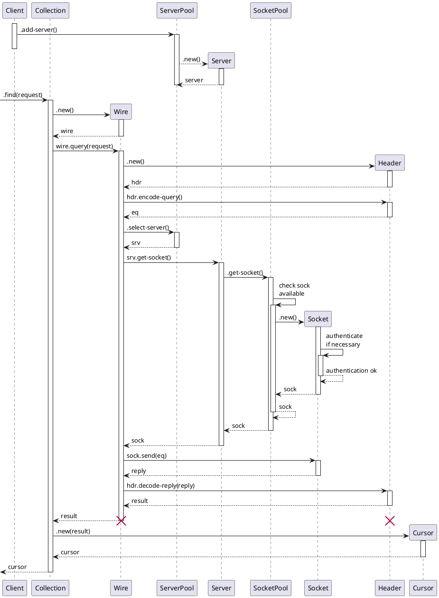

<!--

Application -> Client : .new(:uri)
activate Client
Client -> Application : cl
Application -> Client : cl.database(:name)
Client -> Database : .new(:name)
activate Database
Database -> Application : db
Application -> Database : db.run-command(command)

Database -> Collection ++: .new(:name)
Collection -> Database : col
Database -> Collection: col.find(command)

Collection -> Wire: .query
activate Wire

Wire -> ServerPool: .select-server()
activate ServerPool
ServerPool -> Wire: server
activate Server
Wire -> Server: .get-socket()
activate SocketPool
SocketPool -> Wire: socket

Wire -> Socket

Collection -> Cursor ++:
Cursor -> Database --: Document
deactivate Collection

Database -> Application : document

-->
