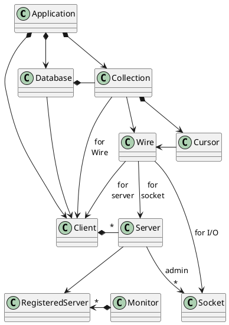

```plantuml
@startuml

Application *--> Client
Application *--> Database
Application *-> Collection
Client *- "*" Server
Database -> Client
Client <-- Collection: for\nWire
Database *- Collection
Collection --> Wire
Collection *--> Cursor

Wire <- Cursor
Wire --> Client: for\nserver
Wire -> Server: for\nsocket
Wire -> Socket: for I/O

Server --> "*" Socket: admin
Monitor *-> "*" RegisteredServer
Server --> RegisteredServer

@enduml
```
