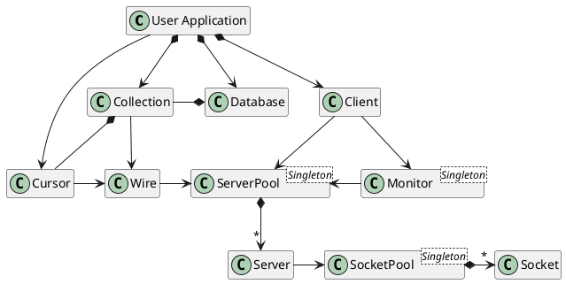

```plantuml
@startuml

skinparam packageStyle rectangle
skinparam stereotypeCBackgroundColor #80ffff
'set namespaceSeparator ::
hide members

class "User Application" as Application
class Monitor<Singleton>
class ServerPool<Singleton>
class SocketPool<Singleton>

Application *--> Client
Application *--> Database
Application *--> Collection

Client --> Monitor
Client --> ServerPool
ServerPool *--> "*" Server
Server -> SocketPool
SocketPool *-> "*" Socket
Collection -* Database
Collection -> Wire
Collection *-- Cursor
Application --> Cursor

Cursor -> Wire
Wire -> ServerPool
ServerPool <- Monitor

@enduml
```
