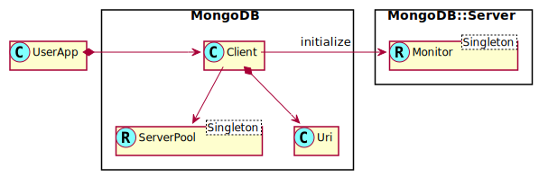

MongoDB::Client
===============

Class to define connections to servers

Description
===========

This class is your most often used class. It maintains the connection to the servers specified in the given uri. In the background it starts a monitor (only once) and manage the server pool.

The options which can be used in the uri are in the following tables. See also [this information](https://docs.mongodb.com/manual/reference/connection-string/#connection-string-options) for more details.

Synopsis
========

Declaration
-----------

    unit class MongoDB::Client;

Uml Diagram
-----------

See Also
========

  * MongoDB::Uri; For Uri handling.

  * MongoDB::Database; Accessing the database using `.run-command()`.

  * MongoDB::Collection; Less often used to use the `.find()` method on a collection.

Example
=======

    my MongoDB::Client $client .= new(:uri<mongodb://>);
    my MongoDB::Database $people-db = $client.database('people');

    my BSON::Document $request .= new: (
      insert => 'famous-people',
      documents => [ (
          name => 'Larry',
          surname => 'Wall',
        ),
      ]
    );

    my BSON::Document $doc = $people-db.run-command($request);
    say $doc<ok> ?? 'insert request ok' !! 'failed to insert';

Types
=====

uri-obj
-------

The uri object after parsing the uri string. All information about the connection can be found here such as host and port number.

    has MongoDB::Uri $.uri-obj;

Methods
=======

new
---

Create a `MongoDB::Client` object. The servers are reachable in both ipv4 and ipv6 domains. The ipv4 domain is tried first and after a failure ipv6 is tried. To specify a specific address, the following formats are possible; `mongodb://127.0.0.1:27017` for ipv4 or `mongodb://[::1]:27017` for ipv6.

Defined as

    new ( Str:D :$!uri! )

  * :uri; Uri to describe servers and options

**Note**. It is important to keep the following in mind to prevent memory leakage. The object must be cleaned up by hand before the variable is reused. This is because the Client object creates some background processes to keep an eye on the server and to update server object states and topology.

    my MongoDB::Client $client .= new(:uri(…));
    … work with object …
    $client.cleanup;

Some help is given by the object creation. When it notices that the object is defined along with some internal variables, it will destroy that object first before continuing. This also means that you must not use another `MongoDB::Client` object to create a new one!

When used for the first time, no leakage is possible

    my MongoDB::Client $c1, $c2;
    $c1 .= new(:uri(…));

In the next step, object `$c1` will be destroyed because `.new()` will check if the object is defined. So, do not do this unless you want that behavior.

    $c2 = $c1.new(:uri(…));

This is ok however, because we want to overwrite the object anyway

    $c2 .= new(:uri(…));

And this might result in memory leakage if `DESTROY()` cannot cleanup the object properly, because `$c2` was already defined. With an extra note that in the background servers mentioned in `$c2` will continue to be monitored resulting in loss of performance for the rest of the program!

    $c2 = MongoDB::Client.new(:uri(…));

Note that the servers named in the uri must have something in common such as a replica set. Servers are refused when there is some problem between them e.g. both are master servers. In such situations another `MongoDB::Client` object should be created for the other server.

database
--------

Create a database object. In mongodb a database and its collections are only created when data is written in a collection.

    method database ( Str:D $name --> MongoDB::Database )

collection
----------

Create a collection. A shortcut to define a database and collection at once. The names for the database and collection are given in the string full-collection-name. This is a string of two names separated by a dot '.'.

A name like `contacts.family` means to create and/or access a database `contacts` with a collection `family`.

    method collection ( Str:D $full-collection-name --> MongoDB::Collection )

cleanup
-------

Stop any background work on the Server object as well as the Monitor object. The cleanup all structures so the object can be cleaned further by the Garbage Collector later.

    method cleanup ( )

server-status
-------------

Return the status of some server.

    method server-status ( Str:D $server-name --> ServerType )

topology
--------

Return the topology of which the set of servers represents.

    method topology ( --> TopologyType )

