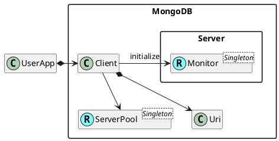

```plantuml
@startuml

skinparam packageStyle rectangle
skinparam stereotypeCBackgroundColor #80ffff
set namespaceSeparator ::
hide empty members


'Classes and interfaces

Interface MongoDB::Server::Monitor <Singleton>
class MongoDB::Server::Monitor <<(R,#80ffff)>>

Interface MongoDB::ServerPool <Singleton>
class MongoDB::ServerPool <<(R,#80ffff)>>


'Class connections
UserApp *-> MongoDB::Client
MongoDB::Client -> MongoDB::Server::Monitor: initialize
MongoDB::Client --> MongoDB::ServerPool
MongoDB::Client *--> MongoDB::Uri
@enduml
```
