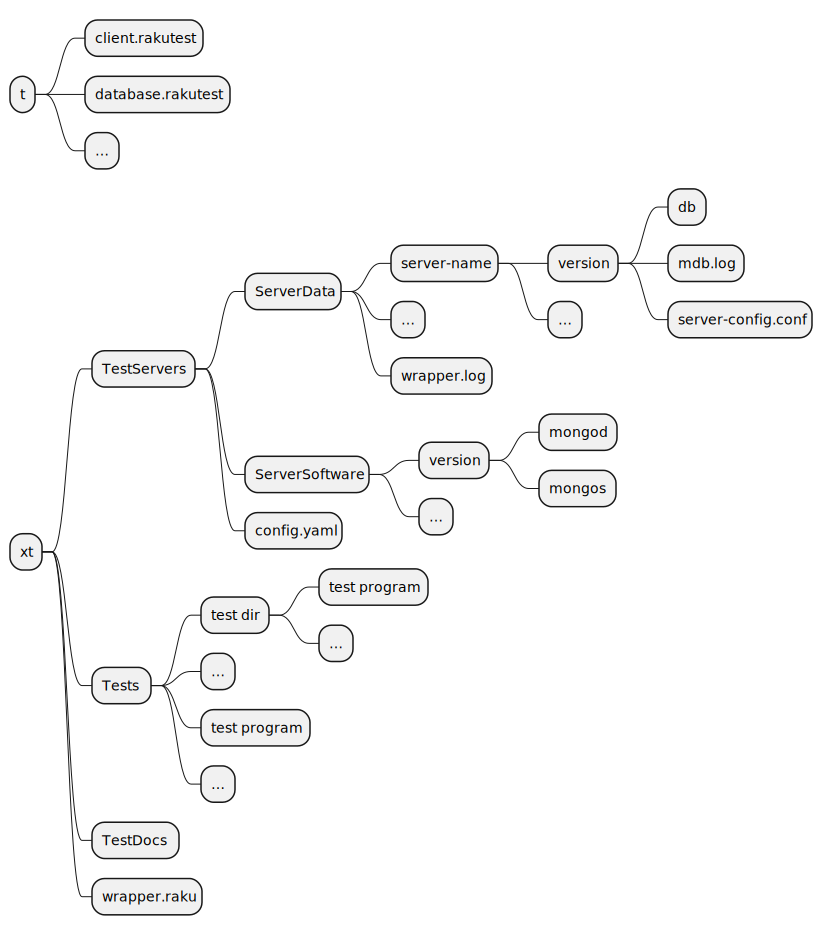

# Introduction

The test setup is completely changed due to its complexity. The main reason is that I want to run tests which are destructive for the users database. Examples are;
* Start and stop a server
* Add and remove accounts
* Work on other collections than the test collection
* Add and remove data
* Run tests which need more than one server, like e.g;
  * Setup replica sets
  * Use sharded servers
  * Other type of servers

So first of all, the tests the user get to run when installing the package is only a load of the modules. This is a Raku compile test.

The tests I want to do to test the package are done on my system in a Linux Fedora environment. Also I want to test the software in a docker environment created by **JJ Merelo**, which can be done in two ways, here or on `github actions`. That environment is an Ubuntu Linux system.
TODO; `github actions` has also the possibility to test directly but is failing to find the `rakudo` program after installing. This would be the way to also be able to test for `Windows` or `MacOS`.

# Setup

## Directory **t**
The `t` directory is used to run tests when installing the driver. These tests are simple.

## Directory **xt**
The `xt` directory is used for the other tests. These are not run when installing the driver.

* `xt/TestServers` is used to store the **mongod** and **mongos** servers of different versions and the run time environment of those servers as well as the configuration of it.
* `xt/Tests` is used to store the test programs
* `xt/TestDocs` is for the documentation and results
* `xt/wrapper.raku` is the test control program
  

The program `wrapper.raku` reads a configuration file `TestServers/config.yaml`. Using the provided information it generates the `TestServers/ServerData`. When a server is started, the `TestServers/ServerData/server-name/version/db` directory is filled with data generated by the server. The `server-name` is a key used to find info in the config file. The `version` is used to select the proper server binary.
